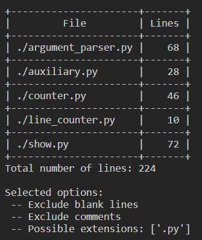

# Line Counter <!-- omit in toc -->
Program to count lines of a file or files in a directory structure

:zap: Powered by 
    <a href="https://www.python.org" target="_blank"> </a>
 
Created in version 3.9.7

+ :construction: Still WIP
+ :computer: Feel free to fork this repository
+ :star: If you like this app star the repository

## Table of Contents <!-- omit in toc -->
- [Usage](#usage)
  - [Options:](#options)
- [Output](#output)
  - [Example](#example)
- [License](#license)

## Usage
`python3 <PATH>/line_counter.py`

### Options:
```
-h, --help
    show usage

-t, --target PATH
    specify path of a file or a directory

-b, --blanklines
    exlude blank lines from the calculation

-c, --comments
    exclude comments from the calculation

-e, --extensions EXTENSIONS
    specify files to be included in the calculation

-i, --ignore EXTENSIONS
    specify file to be ignored from the calculation

-d, --depth NUMBER (Integer)
    specify depth of recursion
```

**Options info**
+ `-t, --target`
  + Default is CWD.

<br>

+ `-e, --extension EXTENSIONS`, `-i, --ignore EXTENSIONS`
  + format of `EXTENSIONS`
  + **comma-separated** and **without spaces**
  + example: *.py,.java,.html*

<br>

+ `-d, --depth DEPTH`
  + Default is maxial depth (all subdirectories).
  + `DEPTH` examples:
    + 0 = no recursion (only target)
    + 1 = one level of recursion (target + its directories)

## Output
Output is in the form of a table and a list of selected options.

### Example
`line_counter --target=./ -e .py -c -b`


## License
[**MIT License**](./LICENSE)
